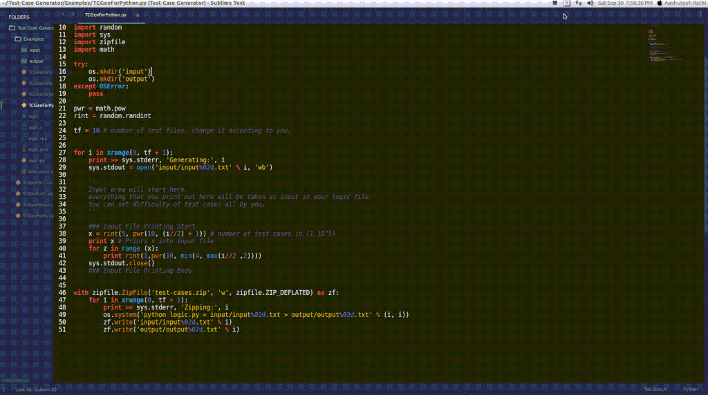

## HackerRank Test Case Generator

One Click Test Case Generation for HackerRank Problems.

Are you a Problem Author?

The toughest part of creating a problem is creating tricky, correct and constrained Test Cases.

Well, Here is one Click **Python 2** Codes, for your respective logic(solution) files.

Logic File | TC Generator Files | Example Files |
------------------ | ------------- | ---------------
C | [TC Generator for C](TC-Generators/TCGenForC.py) | [C](Examples/C) |
C++ | [TC Generator for C++](TC-Generators/TCGenForC++.py) | [C++](Examples/C++) |
Java | [TC Generator for Java](TC-Generators/TCGenForJava.py) | [Java](Examples/Java) |
Python | [TC Generator for Python](TC-Generators/TCGenForPy.py) | [Python](Examples/Python) |

## How it Works ?

 Made with ❤ by <a href="https://github.com/aashutoshrathi">Aashutosh Rathi</a>
