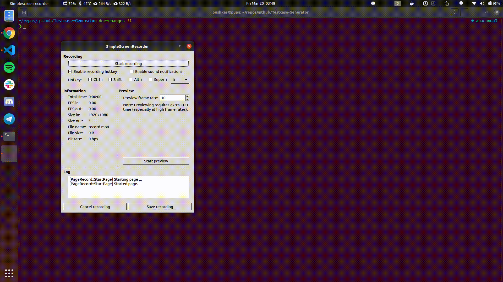

# Testcase Generator

[](#)

[](https://travis-ci.org/aashutoshrathi/Testcase-Generator)

One Click Test Case Generation for [HackerRank](https://eee.hackerrank.com), [HackerEarth](https://www.hackerearth.com) and [CodeChef](https://www.codechef.com) Problems.

Are you a Problem Author?

The toughest part of creating a problem is creating tricky, correct and constrained Test Cases.

Well, Here is one Click **Python** Code, for your respective logic (solution).

# Table of Contents
- [Testcase Generator](#testcase-generator)
- [Table of Contents](#table-of-contents)
- [Mentions](#mentions)
- [Supported Languages](#supported-languages)
- [Install](#install)
  - [How to Use ? 😃](#how-to-use--)
  - [How it Works ? 🤔](#how-it-works--)
  - [Setup using Docker 🐳](#setup-using-docker-)
  - [Running Tests ✅](#running-tests-)
- [Contributors ✨](#contributors-)
- [Stargazers over time 📈](#stargazers-over-time-)

# Mentions

- [Blog post](https://medium.com/@agarwalrounak/my-nwoc-njack-winter-of-code-2018-experience-badf30b9c02d) on experince in NWoC 2018 by Rounak Agarwal.
- Selected as project in [GSSoC 2019](https://www.gssoc.tech/projects.html)
- Selected as project in [NJACKWinterOfCode 2018]([https://github.com/NJACKWinterOfCode/HackerRank-Test-Case-Generator](https://njackwinterofcode.github.io/))

# Supported Languages

The following languages are supported for testcase generation:

- [C](/tc_generator/logic.c)
- [C++](/tc_generator/logic.cpp)
- [Java](/tc_generator/logic.java)
- [Python](/tc_generator/logic.py)
- [C#](/tc_generator/logic.cs)
- [Go](/tc_generator/logic.go)

# Install

## How to Use ? 😃

* Clone the repository `$ git clone https://github.com/aashutoshrathi/Testcase-Generator.git`

* Create a virtual environment `$ virtualenv venv ` ([click here](https://stackoverflow.com/questions/14604699/how-to-activate-virtualenv) to read about activating virtualenv)
  * #### Activate virtualenv (Linux)
  ```sh
    $ source ./venv/bin/activate
  ```
  * #### Activate virtualenv (Windows)
  ```sh
     $ cd venv/Scripts/
     $ activate
  ```
* Install requirements and modules
```sh
   $ pip install -r requirements.txt
   $ pip install -e .
```
* Change directory to `tc_generator `
```sh
   $ cd tc_generator/
```
* **Edit the logic file of the language of your choice with the code for which you want to generate TCs**
NOTE: Make sure to keep the classname as '*logic*' in java so that it can compile to '*logic.class*'
* **Edit the Input area in ```tc_gen.py``` according to the input format you wish to generate**
* Run the project
```sh
   $ python tc_gen.py
```
* Enter your choice of language when prompted
* Enter the choice of platform when prompted
* The input and output files would be generated and stored in `test-cases.zip` for HackerRank & HackerEarth and `test-cases` directory for CodeChef.

## How it Works ? 🤔



## Setup using Docker 🐳

```sh
  docker build . --tag=tcgen
  docker run -p 4000:80 tcgen
```

## Running Tests ✅

* Change Directory to `Testcase-Generator`
```sh
  $ cd Testcase-Generator/
```
* Install requirements and modules
```sh
   $ pip install -r requirements.txt
   $ pip install -e .
```
* Run `pytest`
```sh
  $ pytest
```
* If the code shows '5 tests passed', the generator is working correctly.

# Contributors ✨

Thanks goes to these wonderful people ([emoji key](https://allcontributors.org/docs/en/emoji-key)):

<!-- ALL-CONTRIBUTORS-LIST:START - Do not remove or modify this section -->
<!-- prettier-ignore-start -->
<!-- markdownlint-disable -->
<table>
  <tr>
    <td align="center"><a href="http://aashutosh.dev"><br /><sub><b>Aashutosh Rathi</b></sub></a><br /><a href="#tool-aashutoshrathi" title="Tools">🔧</a> <a href="#projectManagement-aashutoshrathi" title="Project Management">📆</a> <a href="https://github.com/aashutoshrathi/Testcase-Generator/pulls?q=is%3Apr+reviewed-by%3Aaashutoshrathi" title="Reviewed Pull Requests">👀</a> <a href="https://github.com/aashutoshrathi/Testcase-Generator/issues?q=author%3Aaashutoshrathi" title="Bug reports">🐛</a> <a href="https://github.com/aashutoshrathi/Testcase-Generator/commits?author=aashutoshrathi" title="Code">💻</a></td>
    <td align="center"><a href="https://github.com/thepushkarp"><br /><sub><b>Pushkar Patel</b></sub></a><br /><a href="#maintenance-thepushkarp" title="Maintenance">🚧</a> <a href="https://github.com/aashutoshrathi/Testcase-Generator/commits?author=thepushkarp" title="Tests">⚠️</a> <a href="https://github.com/aashutoshrathi/Testcase-Generator/issues?q=author%3Athepushkarp" title="Bug reports">🐛</a> <a href="https://github.com/aashutoshrathi/Testcase-Generator/commits?author=thepushkarp" title="Code">💻</a></td>
    <td align="center"><a href="https://github.com/prithaupadhyay"><br /><sub><b>Pritha Upadhyay</b></sub></a><br /><a href="#maintenance-prithaupadhyay" title="Maintenance">🚧</a> <a href="https://github.com/aashutoshrathi/Testcase-Generator/commits?author=prithaupadhyay" title="Tests">⚠️</a> <a href="https://github.com/aashutoshrathi/Testcase-Generator/issues?q=author%3Aprithaupadhyay" title="Bug reports">🐛</a> <a href="https://github.com/aashutoshrathi/Testcase-Generator/commits?author=prithaupadhyay" title="Code">💻</a></td>
  </tr>
</table>

<!-- markdownlint-enable -->
<!-- prettier-ignore-end -->
<!-- ALL-CONTRIBUTORS-LIST:END -->

This project follows the [all-contributors](https://github.com/all-contributors/all-contributors) specification. Contributions of any kind welcome!

# Stargazers over time 📈

[](https://starcharts.herokuapp.com/aashutoshrathi/Testcase-Generator)

<p align="center"> Made with ❤ by <a href="https://github.com/aashutoshrathi">Aashutosh Rathi</a></p>
